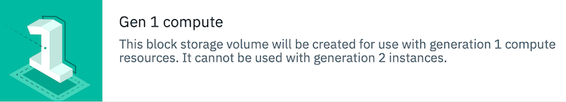

---

copyright:
  years: 2019, 2020
lastupdated: "2020-03-19"

keywords: block storage, getting started, IBM Cloud, VPC, virtual private cloud, IBM CLoud, volume, data storage, classic, virtual server

subcollection: vpc-on-classic-block-storage

---
{:shortdesc: .shortdesc}
{:codeblock: .codeblock}
{:screen: .screen}
{:external: target="_blank" .external}
{:pre: .pre}
{:tip: .tip}
{:table: .aria-labeledby="caption"}
{:important: .important}
{:note: .note}
{:shortdesc: .shortdesc}
{:DomainName: data-hd-keyref="APPDomain"}
{:DomainName: data-hd-keyref="DomainName"}
{:external: target="_blank" .external}

# Getting started with {{site.data.keyword.block_storage_is_short}}
{: #getting-started}

Use {{site.data.keyword.block_storage_is_full}} (VPC) to provision storage resources for use with generation 1 compute instances in the {{site.data.keyword.cloud_notm}}.
{: .shortdesc}

{: caption="Figure 1. This is the banner that appears when you are creating generation 1 compute resources in the console." caption-side="bottom"}

New! Check out block storage for generation 2 virtual server instances. For more information, see  [Planning for instances (Generation 2)](/docs/vpc?topic=vpc-vsi_best_practices).
{:tip}

You can create as many block storage volumes as you need to support your compute resources, available in an improved IBM Cloud console. The console is built to provide you with quick and easy access to provision your storage resources for your changing workload requirements. Let's get started!

{{site.data.keyword.block_storage_is_short}} provides features unique to the VPC and is not compatible with earlier IBM Cloud block storage. If you're interested in this infrastructure, see [{{site.data.keyword.blockstoragefull}}](/docs/BlockStorage?topic=BlockStorage-About).
{:note}

## Before you begin
{: #block-storage-before-you-begin}

First review the content that can help with your implementation. Are you new to {{site.data.keyword.cloud}} and {{site.data.keyword.block_storage_is_short}}? The following information might help:

* [{{site.data.keyword.vpc_full}}](https://www.ibm.com/cloud/vpc){: external}
* [About Block Storage for VPC](/docs/vpc-on-classic-block-storage?topic=vpc-on-classic-block-storage-block-storage-about)

Sign up for an {{site.data.keyword.cloud_notm}} account. For more information, see [Signing up for {{site.data.keyword.cloud_notm}}](https://cloud.ibm.com/docs/account?topic=account-signup#signup){: external}.

## Step 1 - Determine your storage requirements
{: #determine-storage-requirements}

Are you running general purpose workloads with modest storage requirements? Or, are your workloads I/O intense that require higher capacity and performance? To learn more about how you can determine capacity and performance, see [Block Storage capacity and performance](/docs/vpc-on-classic-block-storage?topic=vpc-on-classic-block-storage-capacity-performance). Also see [Profiles](/docs/vpc-on-classic-block-storage?topic=vpc-on-classic-block-storage-block-storage-profiles) to learn which IOPS profile option can best meet your storage requirements. 

Are you creating a virtual server instance as well? See [how virtual server profiles relate to storage profiles](/docs/vpc-on-classic-block-storage?topic=vpc-on-classic-block-storage-block-storage-profiles#vsi-profiles-relate-to-storage).

## Step 2 - Size and price your block storage
{: #size-price-block-storage}

Select an [IOPS tier profile](/docs/vpc-on-classic-block-storage?topic=vpc-on-classic-block-storage-block-storage-profiles#tiers) for your block storage volume.  Optionally, if you have well-defined performance requirements that don't fall within a predefined IOPS tier, choose a [custom IOPS profile](/docs/vpc-on-classic-block-storage?topic=vpc-on-classic-block-storage-block-storage-profiles#custom).

After choosing the size and performance for your block storage volumes, see the [Pricing](/docs/vpc-on-classic?topic=vpc-on-classic-pricing-for-vpc#pricing-for-block-storage-for-vpc) information to help you price your volumes and understand how you're billed.

## Step 3 - Log into your {{site.data.keyword.cloud_notm}} account
{: block-storage-log-into-ibm-account}

Access the {{site.data.keyword.block_storage_is_short}} Order Form from the [{{site.data.keyword.cloud_notm}} catalog](https://{DomainName}/catalog){: external}. Use your IBMid and password.

## Step 4 (optional) -  Verify access to the {{site.data.keyword.vpc_short}}

If you want to create a volume within a Virtual Private Cloud, you must first [create a VPC](/docs/vpc-on-classic?topic=vpc-on-classic-creating-a-vpc-using-the-ibm-cloud-console). Skip this step if you want to create a standalone volume outside the VPC. You can later request access to {{site.data.keyword.vpc_short}} to access an instance and attach a block storage volume that you independently created. For more information about {{site.data.keyword.vpc_short}}, see [Getting started with Virtual Private Cloud on Classic](/docs/vpc-on-classic?topic=vpc-on-classic-getting-started).

## Step 5 - Create block storage volumes

Begin creating your volumes in the [{{site.data.keyword.cloud_notm}} console (UI)](/docs/vpc-on-classic-block-storage?topic=vpc-on-classic-block-storage-creating-block-storage), or by using the [CLI](/docs/vpc-on-classic-block-storage?topic=vpc-on-classic-block-storage-creating-block-storage-cli) or [{{site.data.keyword.vpc_short}} API](https://{DomainName}/apidocs/vpc-on-classic#create-a-volume){: external}. For more information about using the IBM Cloud Developer tools to install the IBM Cloud CLI, see [Getting started with IBM Cloud Developer tools](/docs/cli?topic=cloud-cli-getting-started).

## Next steps
{: #next-step-block-storage-getting-started}

After creating a {{site.data.keyword.block_storage_is_full}} (VPC) volume and attaching it to an instance, to use your block storage volume as a filesystem, you'll need to partition the volume, format the volume, and then mount it as a filesystem.  For information, see [Use your block storage data volume (CLI)](/docs/vpc-on-classic-block-storage?topic=vpc-on-classic-block-storage-start-using-your-block-storage-data-volume).

Also, explore these options:

* [View details about the volume](/docs/vpc-on-classic-block-storage?topic=vpc-on-classic-block-storage-viewing-block-storage)
* [Manage your block storage volumes](/docs/vpc-on-classic-block-storage?topic=vpc-on-classic-block-storage-managing-block-storage#managing-block-storage)
